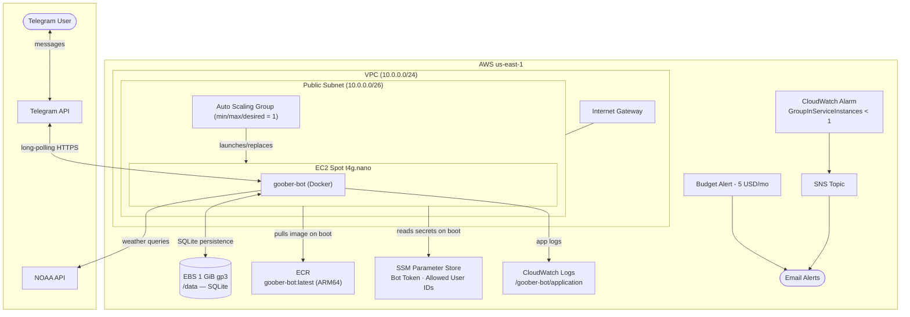

# aws-infra
This repo contains the infrastructure-as-code and any other configuration necessary for maintaining my AWS environment.

## goober-bot (prod)

Deploys [goober-bot](https://github.com/technogoose56/goober-bot) — a Go Telegram bot — on an EC2 Spot t4g.nano instance (~$1.82/mo).

